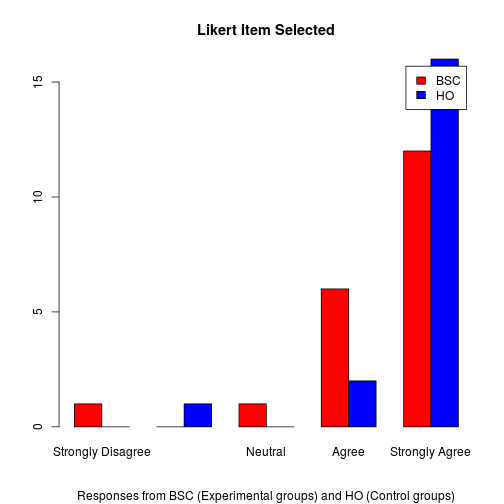

<style>
.small-code pre code {
  font-size: 1em;
}
.footer {
    color: black; background: #E8E8E8;
    position: fixed; top: 90%;
    text-align:center; width:100%;
</style>

Analysing a Likert Scale
========================================================
author: Carlos Rodriguez, PhD
date: December 26, 2015 

Introduction
========
class: small-code
The app in [shinyapps](https://crconline.shinyapps.io/project) is intended to analyse each one of the 40 Likert items which compose a Likert scale answered by 39 participants in an experiment to prove whether the Balanced Scorecard is better in developing Business Plans than the traditional method.

The app allows you to choose a Likert item, one a time, and executes a CHI Squared test.

As <span style="font-weight:bold; color:red;"> shinyapps.io </span> does not support <span style="font-weight:bold; color:red;"> HH </span> package, I installed an alternative shiny server running in my computer, this can generate graphics with such package, please visit it [here](http://www.crconline.dynamicdns.org.uk:3838/apps/project/).

Downloading and reading the dataset
========================================================
class: small-code

<div class="footer" style="margin-top:-150px;font-size:60%;">
Column <span style="font-weight:bold; color:red;">PART</span> represents each individual participant. Column <span style="font-weight:bold; color:red;">TRAT</span> contains the method used: BSC for the Balanced Scorecard, HO for the traditional method. Following columns contains each individual response for each Likert item, for example column <span style="font-weight:bold; color:red;">c1i1</span> contains the individual responses for the item <span style="font-weight:bold; color:red;">Time devoted to exercise was definitively well seized</span>. Each response is a value between 1 and  5, being 1 = Strongly Disagree; 2 = Disagree; 3 = Neutral; 4 = Agree; and 5 = Strongly Agree.</div>

We first download the dataset from [dropbox](https://dl.dropboxusercontent.com/u/95175494/datasets/likertscale.csv). 

Below appears the output of the <span style="font-weight:bold;">names</span> command over the dataset:

```
 [1] "PART"  "TRAT"  "c1i1"  "c1i2"  "c1i3"  "c1i4"  "c1i5"  "c1i6" 
 [9] "c2i1"  "c2i2"  "c2i3"  "c2i4"  "c2i5"  "c2i6"  "c2i7"  "c2i8" 
[17] "c2i9"  "c2i10" "c2i11" "c3i1"  "c3i2"  "c3i3"  "c3i4"  "c3i5" 
[25] "c4i1"  "c4i2"  "c4i3"  "c5i1"  "c5i2"  "c5i3"  "c5i4"  "c5i5" 
[33] "c5i6"  "c6i1"  "c6i2"  "c6i3"  "c6i4"  "c6i5"  "c6i6"  "c6i7" 
[41] "c6i8"  "c6i9" 
```

Crosstab of a Likert item
========
class: small-code

<div class="footer" style="margin-top:-150px;font-size:60%;">
Variable by rows is the <span style="font-weight:bold; color:red;">Treatment</span> which is a dichotomic variable where <span style="font-weight:bold; color:blue;">BSC</span> contains the responses of the participants that used the Balanced Scorecard, <span style="font-weight:bold; color:blue;">HO</span> contains the responses of the participants that used the traditional method. Variable by columns contains the responses for each level of agreement: Each column accumulates individual responses, giving 1 point for each case where a individual selected one of the options which are: Strongly Disagree; Disagree; Neutral; Agree; and Strongly Agree.</div>

For each Likert item, a crosstab is built to view the level of responses for each treatment:


```r
xt <- xtabs(~ TRAT + c1i1, data = likert)
        dimnames(xt) = list("Treatment"=c("BSC","HO"),"Responses"=c("Strongly Disagree", "Disagree","Neutral","Agree","Strongly Agree"))
        xt
```

```
         Responses
Treatment Strongly Disagree Disagree Neutral Agree Strongly Agree
      BSC                 1        0       1     6             12
      HO                  0        1       0     2             16
```


CHI Squared test for a Likert item
========================================================
class: small-code

<div class="footer" style="margin-bottom:-150px;font-size:60%;">
If p-value is less than 0.05, there is a statistically significant difference between the method BSC and HO. The graphic shows the levels of response for each method.</div>


```r
chisq.test(xt)
```

```

	Pearson's Chi-squared test

data:  xt
X-squared = 5.5494, df = 4, p-value = 0.2354
```

***



